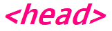
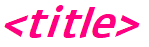
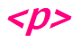
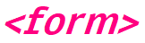
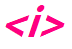

<h1 align="center">🚀 HTML 🚀</h1>


<div align="center">
  
</div>

<h4>Os atributos são usados para personalizar as tags, modificando sua estrutura ou funcionalidade. Portanto, os atributos são utilizados para atribuir uma classe ou id a um elemento. Esses são os principais, porém existe vários.</h4> <br/>

**class=”…“** – Atribui uma classe ao elemento (uma classe pode ser utilizada para um ou mais elementos); <br/><br/>
**id=”…“** – Atribui um id ao elemento (um id deve ser único, ou seja, atribuído a um único elemento);<br/> <br/>
**style=”…”** – Permite incluir elementos CSS (estilos) dentro da tag;<br/><br/>
**lang=”…”** – Define o idioma principal do elemento;<br/><br/>
**title=”…”** – Define o título do elemento;<br/><br/>
**alt=”…”** – Define um texto alternativo e, por isso, é muito utilizado em imagens, auxilia nas práticas de SEO;<br/><br/>
**hidden** – Oculta o elemento;<br/><br/>
**align=”…”** – Permite definir o padrão de alinhamento desse elemento, como por exemplo: right, center, left e justify;<br/><br/>
**width=”…”** – Define uma largura para o elemento;<br/><br/>
**height=”…”** – Define uma altura para o elemento.<br/> <br/>

<hr>

<details>
<summary>
  <strong>🔍 Sumário</strong>
</summary>
  
> <h4>📚 Tópicos</h4>
>
> *[Tags](#tags)*\
> *[Estruturas](#estruturas)*\
> *[Formulários](#forms)*\
> *[Tabelas](#tabelas)*\
> *[Listas](#listas)*\
> *[Formatação](#format)*
>
> <h4>💡 Pull Requests</h4>
> 
> *[Deseja contribuir com esse projeto? ](#contribuir)*
</details>

<hr>

<div align="center" id="tags">
  
</div>

<br/>

<div>
  
</div>

<br/>

Obs: Ele não será exibido em tela.

```bash
<!-- Escreva seu comentário -->
```

<div>
  
</div>

Utilizada para iniciar e indicar a versão do Html. <br/>
Por exemplo, Html:5

```bash
<!DOCTYPE html>
<html lang="en">
<head>
  <meta charset="UTF-8">
  <meta name="viewport" content="width=device-width, initial-scale=1.0">
  <title>Document</title>
</head>
<body>
</body>
</html>
```

<div>
  
</div>

<br/>

Todo conteúdo do código Html.

```bash
<html>
  <head></head>
  <body></body>
</html>
```

<div>
  
</div>

<br/>

A tag head representa uma coleção de metadados para o documento onde não são exibidos no navegador. Metadados são, dados sobre os dados. E é utilizada para inserir informações do cabeçalho do documento, como título, links para css, links para favicons, links para fontes e outros metadados, como: Quem o escreveu, palavras-chave importantes que descrevem o documento etc.

```bash
<head>
    <meta charset="UTF-8" />
    <meta name="viewport" content="width=device-width, initial-scale=1.0" />
    <link rel="stylesheet" href="./styles.css" />
    <link rel="preconnect" href="https://fonts.gstatic.com" />
    <link
      href="https://fonts.googleapis.com/css2?family=Montserrat&display=swap"
      rel="stylesheet"
    />
    <link rel="icon" type="image/png" sizes="16x16" href="./images/icon.png" />
    <title>Tags Html</title>
</head>
```

<div>
  
</div>

<br/>

Utilizada para inserir o título da página web (Guia).

```bash
<title>Escreva o Título</title>
```

<div>
  
</div>

<br/>

Os metadados contendo informações do documento.

```bash
<meta charset="UTF-8" />
<meta name="viewport" content="width=device-width, initial-scale=1.0" />
```

<div>
  
</div>

<br/>

Inclusão de outros documentos.

```bash
<link rel="stylesheet" href="./styles.css" />
<link rel="preconnect" href="https://fonts.gstatic.com" />
<link
  href="https://fonts.googleapis.com/css2?family=Montserrat&display=swap"
  rel="stylesheet"
/>
<link rel="icon" type="image/png" sizes="16x16" href="./images/icon.png" />
```

<div>
  
</div>

<br/>

Todo corpo do documento.

```bash
<body>
    <section>
      <div>
        <nav>
          <a href="#"></a>
        </nav>
      </div>
    </section>
    <footer></footer>
    <script src="scripts.js"></script>
</body>
```

<br/>

**Obs:** Todas as tags a seguir, poderão ser utilizadas dentro do body.

<div>
  
</div>

<br/>

Estilização do conteúdo.

```bash
<h2 style="color: rgb(240, 58, 164)">Styles</h2>
```

<div>
  
</div>

<br/>

Utilizado para colocar o contéudo de linguagem script.

```bash
<script src="scripts.js"></script>
```

<div>
  
</div>

<br/>

Parágrafo.

```bash
<p>Escreva seu texto</p>
```

<div>
  
</div>

<br/>

O elemento <-a-> ou também chamado de elemnto âncora, é utilizado para a criação de links, e, com o atributo **href** cria-se um hiperligação nas páginas web, arquivos, endereços de emails, ligações na mesma página ou endereços na URL. Existem outros atributos, mas estes são os mais utilizados.

```bash
<a href="#" target="_blank" rel="noreferrer noopener"></a>
<a href="https://site.com">Website</a>
<a href="mailto:email@gmail.com">Email</a>
<a href="tel:+123456789">Phone</a>
```

<br/>

**href=""** – Utilizado para criar hiperligações entre páginas; <br/>
**mailto:** – Utilizado para inserir e-mails; <br/>
**tel:** – Utilizado para inserir números de telefone; <br/>
**target="\_blank"** – Utilizado para abrir uma nova aba; <br/>
**Obs:** Utilize **rel="noreferrer noopener"**, juntamente com o **\_blank**, para evitar "exploit". Usar target="\_blank" sem rel="noreferrer" ou rel="noopener" torna o site vulnerável a window.opener. <br/>

<div>
  
</div>

<br/>

Utilizada para inserir imagens.

```bash

```

### Formatos de imagens suportados:

<ul>
    <li>JPEG</li>
    <li>GIFs</li>
    <li>PNG</li>
    <li>APNG</li>
    <li>SVG</li>
    <li>BMP</li>
    <li>BMP ICO</li>
    <li>PNG ICO</li>
</ul>

<div>
  
</div>

<br/>

É a tag utilizada para representar um texto pré-formatado. Um texto dentro desse elemento é exibido em uma fonte não proporcional da mesma maneira em que o texto original foi escrito no arquivo. Espaços em branco são mantidos no texto da mesma forma em que foi digitado.

```bash
<pre>
body {
  color: pink;
}
</pre>
```

<div>
  
</div>

<br/>

Refere-se ao texto de cabeçalho, onde varia de h1 à h6, sendo h1 o maior font-size (tamanho da letra) e h6 o menor.

```bash
<h1>Text</h1>
<h2>Text</h2>
<h3>Text</h3>
<h4>Text</h4>
<h5>Text</h5>
<h6>Text</h6>
```

<div align="center" id="estruturas">
  
</div>

<br/>

<div>
  
</div>

Conteúdo principal do body (corpo). Entende-se como conteúdo principal aquele relacionado diretamente com o tópico central da página ou com a funcionalidade central da aplicação.
<br/>

```bash
<main>
  <div>

  </div>
</main>
```

<div>
  
</div>

Cabeçalho da página.

<br/>

```bash
<header>
    <h1>Título da Página Principal</h1>
    
</header>
```

<div>
  
</div>

<br/>
Refere-se a uma seção na página.

```bash
<section>
  <h1>Cabeçalho</h1>
  <p>Conteúdo</p>
</section>
```

<div>
  
</div>

<br/>

Refere-se a um artigo na página.

```bash
<article>
  <h4>Um artigo realmente impressionante</h4>
  <p>Texto do artigo.</p>
</article>
```

<div>
  
</div>
<br/>

Refere-se ao conteúdo lateral (ao lado), utilizado para: Definição de um glossário; avisos; biografia do autor; informações de perfil ou links de blogs relacionados.

```bash
<aside>
  <p>Conteúdo relacionado a um article</p>
</aside>
```

<div>
  
</div>
<br/>

Refere-se a uma seção de uma página que aponta para outras páginas ou para outras áreas da página, ou seja, uma seção com links de navegação.

```bash
<nav>
  <ul>
    <li><a href="#">Página inicial</a></li>
    <li><a href="#">Sobre</a></li>
    <li><a href="#">Contato</a></li>
  </ul>
</nav>
```

<div>
  
</div>
<br/>

Refere-se a um container genérico para conteúdo de fluxo, que não representa nada. Ele pode ser utilizado para agrupar elementos para fins de estilos (usando class ou id), ou porque eles compartilham valores de atributos, como lang. Ele deve ser utilizado somente quando não tiver outro elemento de semântica (como <article> ou <nav>). Resumindo, define uma divisão na página.

```bash
<div>
  <p>Qualquer tipo de conteúdo</p>
</div>
```

<div>
  
</div>
<br/>

Refere-se ao rodapé da página. Um rodapé normalmente, contém informações sobre o autor da seção de dados, direitos autorais ou links para documentos relacionados.

```bash
<footer>
  Informações de copyright
</footer>
```

<div align="center" id="forms">
  
</div>
<br/>

Refere-se a criação de um formulário.

<div>
  
</div>
<br/>

```bash
<form>
    <input id="name" type="text" name="name" placeholder="Name" />
    <input id="email" type="email" name="email" placeholder="E-mail" />
    <input id="phone" type="tel" name="phone" placeholder="Phone" />
    <input type="submit" name="action" value="Download" />
</form>

<form action="" method="get">
  <label for="GET-name">Name:</label>
  <input id="GET-name" type="text" name="name">
  <input type="submit" value="Save">
</form>

<form action="" method="post">
  <label for="POST-name">Name:</label>
  <input id="POST-name" type="text" name="name">
  <input type="submit" value="Save">
</form>

<form action="" method="post">
  <fieldset>
    <legend>Title</legend>
    <input type="radio" name="radio" id="radio"> <label for="radio">Click me</label>
  </fieldset>
</form>
```

<div>
  
</div>
<br/>

Refere-se a caixa de entrada de dados.

```bash
<input id="name" type="text" name="name" placeholder="Name" />
<input id="email" type="email" name="email" placeholder="E-mail" />
<input id="phone" type="tel" name="phone" placeholder="Phone" />
<input type="submit" name="action" value="Download" />
```

<div>
  
</div>
<br/>

Refere-se a um campo de texto.

```bash
<textarea name="textarea"
   rows="5" cols="30"
   minlength="10" maxlength="20">Conteúdo</textarea>
```

<div>
  
</div>
<br/>

Refere-se a uma seleção de opções.

```bash
<select name="select">
  <option value="valor1" selected>Valor 1</option>
  <option value="valor2" >Valor 2</option>
  <option value="valor3">Valor 3</option>
</select>
```

<div>
  
</div>
<br/>

Refere-se a definição de uma opção.

```bash
<option value="valor1" selected>Valor 1</option>
<option value="valor2" >Valor 2</option>
<option value="valor3">Valor 3</option>
```

<div>
  
</div>
<br/>

Refere-se a legenda dos campos.

```bash
<label for="name">Name:</label>
<input id="name" type="text" name="name">
```

<div align="center" id="tabelas">
  
</div>
<br/>

<div>
  
</div>
<br/>
Refere-se a criação de uma tabela.

```bash
<table>
  <tr>
    <td>1</td>
    <td>2</td>
  </tr>
  <tr>
    <td>3</td>
    <td>4</td>
  </tr>
</table>

<table>
  <thead>
    <tr>
      <th>Header content 1</th>
      <th>Header content 2</th>
    </tr>
  </thead>
  <tfoot>
    <tr>
      <td>Footer content 1</td>
      <td>Footer content 2</td>
    </tr>
  </tfoot>
  <tbody>
    <tr>
      <td>Body content 1</td>
      <td>Body content 2</td>
    </tr>
  </tbody>
</table>
```

<div>
  
</div>
<br/>

Representa o título/legenda de uma tabela.

```bash
<table>
  <caption>Exemplo de título</caption>
  <tr>
    <th>Login</th>
    <th>Email</th>
  </tr>
</table>
```

<div>
  
</div>
<br/>

Refere-se a linha da tabela.

```bash
<tr>
  <td>1</td>
  <td>2</td>
</tr>
```

<div>
  
</div>
<br/>

Refere-se a célula de cabeçalho da tabela.

```bash
<tr>
  <th>Login</th>
  <th>Email</th>
</tr>
```

<div>
  
</div>
<br/>

Refere-se a célula de dados da tabela.

```bash
<tr>
  <td>1</td>
  <td>2</td>
</tr>
```

<div align="center" id="listas">
  
</div>

<br/>

<div>
  
</div>
<br/>

Refere-se a uma lista ordenada.

```bash
<ol>
  <li>primeiro item</li>
  <li>segundo item</li>
  <li>terceiro item</li>
</ol>

1 - primeiro item
2 - segundo item
3 - terceiro item
```

<div>
  
</div>
<br/>

Refere-se a uma lista não ordenada.

```bash
<ul>
  <li>primeiro item</li>
  <li>segundo item</li>
  <li>terceiro item</li>
</ul>

- primeiro item
- segundo item
- terceiro item
```

<div>
  
</div>
<br/>

Refere-se a um item da lista.

```bash
<li>primeiro item</li>
<li>segundo item</li>
<li>terceiro item</li>
```

<div>
  
</div>
<br/>

Refere-se ao menu com a lista de itens.

```bash
<menu type="toolbar">
  <li>
    <button type="menu" menu="file-menu">File</button>
    <menu type="context" id="file-menu">
      <menuitem label="New..." onclick="newFile()">
      <menuitem label="Save..." onclick="saveFile()">
    </menu>
  </li>
  <li>
    <button type="menu" menu="edit-menu">Edit</button>
    <menu type="context" id="edit-menu">
      <menuitem label="Cut..." onclick="cutEdit()">
      <menuitem label="Copy..." onclick="copyEdit()">
      <menuitem label="Paste..." onclick="pasteEdit()">
    </menu>
  </li>
</menu>
```

<div>
  
</div>
<br/>

Refere-se a a um elemento obsoleto, e é usado como um contêiner para um diretório de arquivos e/ou pastas, potencialmente com estilos e ícones aplicados pelo user agent. Não use este elemento obsoleto; em vez disso, você deve usar a lista não ordenada para listas, incluindo listas de arquivos. <br/>

<div>
  
</div>
<br/>

Refere-se a uma lista de descrição.

```bash
<dl>
  <dt>Firefox</dt>
  <dd>A free, open source, cross-platform, graphical web browser
      developed by the Mozilla Corporation and hundreds of volunteers.</dd>
</dl>
```

<div>
  
</div>
<br/>

Refere-se ao termo a ser descrito.

```bash
<dt>Firefox</dt>
```

<div>
  
</div>
<br/>

Refere-se a descrição, ou seja, o conteúdo da lista.

```bash
<dd>A free, open source, cross-platform, graphical web browser
      developed by the Mozilla Corporation and hundreds of volunteers.
</dd>
```

<div align="center" id="format">
  
</div>

<br/>

<div>
  
</div>
<br/>

Refere-se ao texto em **negrito**.

```bash
<b>Escreva seu texto</b>
```

<div>
  
</div>
<br/>

Refere-se ao texto em itálico.

```bash
<i>Excreva seu texto</i>
```

<div>
  
</div>

<br/>

Refere-se ao texto sublinhado.

```bash
<u>Escreva seu texto</u>
```

<div>
  
</div>

<br/>

Refere-se ao texto em **negrito**.

```bash
 <strong>Escreva seu texto</strong>
```

<div>
  
</div>
<br/>

Refere-se ao texto em itálico.

```bash
<em>Escreva seu texto</em>
```

<div>
  
</div>

<br/>

Refere-se a quebra de linha.

```bash
<br/>
```

<br/>

<h2 id="contribuir">💡 Deseja contribuir com esse projeto?</h2>

### Faça um fork utilizando a linha de comando oficial do GitHub

```bash
$ gh repo fork DeboraZandonai/TagsHtml
```

### Clone o seu fork e e navegue até a pasta

```bash
$ git clone url-do-seu-fork && cd TagsHtml
```

### Crie uma branch com as suas features

```bash
$ git checkout -b minha-feature
```

### Faça um commit das suas alterações

```bash
$ git commit -m 'feat: suas alterações'
```

### Envie o código para a sua branch remota

```bash
$ git push origin minha-feature
```

Depois que a sua pull request for aceita você pode deletar a sua branch.

## 📝 Licença

Este projeto encontra-se sob a licença **MIT**. Para mais informações, acesse o arquivo **LICENSE**.

<h4 align=center>Made with ❤️ by <a href="https://www.linkedin.com/in/debora-zandonai-4ab092195/">Debora Zandonai</a></h4>
